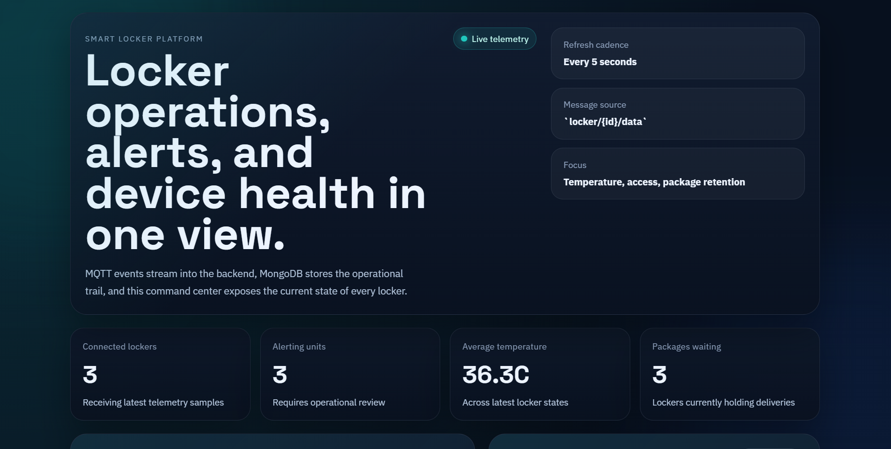
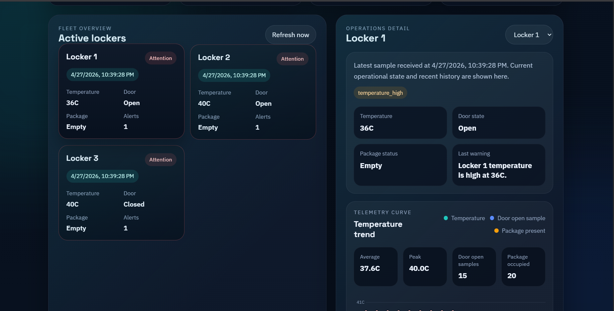
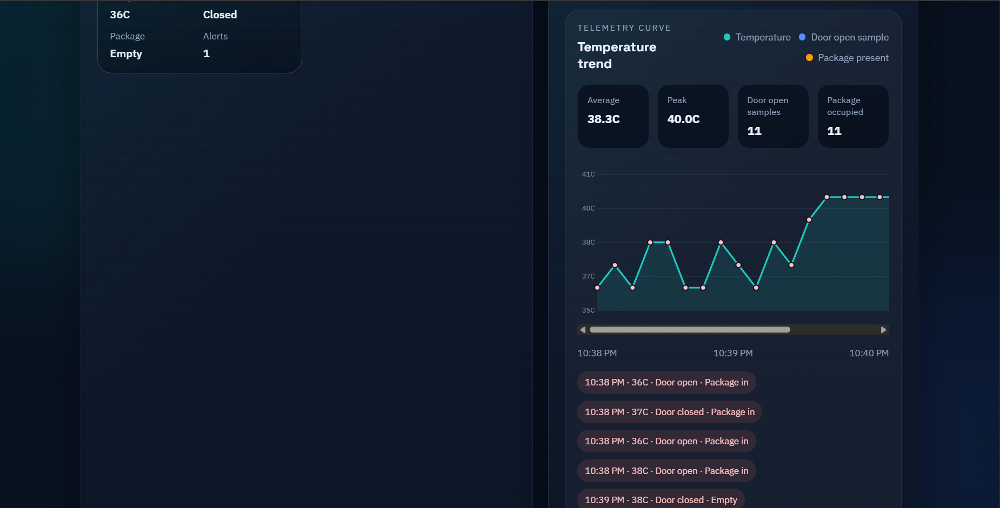

# Smart Locker IoT Platform

A minimal but complete IoT platform for a smart locker system built with Node.js, MQTT, MongoDB, and a live web dashboard.

This project simulates multiple lockers publishing telemetry over MQTT, stores readings in MongoDB, exposes REST APIs for monitoring, and renders a dashboard that looks and behaves like a small operations platform rather than a demo page.

## Stack

- Node.js + Express
- MQTT with `mqtt.js`
- Embedded local MQTT broker with `aedes`
- MongoDB + Mongoose
- Plain HTML, CSS, and JavaScript frontend
- Node.js multi-locker simulator

## What the platform does

- Subscribes to locker telemetry on `locker/{lockerId}/data`
- Stores every incoming reading in MongoDB
- Maintains the latest state for each locker
- Detects operational issues such as:
  - high temperature
  - package retained for too long
  - door left open too long
  - sudden temperature spike
- Exposes REST endpoints for fleet view and history lookup
- Displays a polished dashboard with overview cards, locker status panels, and telemetry charts

## Dashboard overview

The frontend is designed like a lightweight command center.

### 1. Command center hero

The landing section highlights:

- live telemetry status
- refresh cadence
- MQTT topic source
- operational monitoring focus

### 2. Fleet KPIs

The overview cards summarize:

- connected lockers
- alerting units
- average temperature
- packages waiting

### 3. Active lockers panel

Each locker card shows:

- latest update time
- temperature
- door status
- package status
- number of active alerts

### 4. Operations detail panel

For the selected locker, the dashboard shows:

- latest sample timestamp
- current alerts
- current temperature
- current door state
- package state
- last warning message

### 5. Telemetry chart

The telemetry section includes:

- temperature trend chart
- average temperature
- peak temperature
- door-open sample count
- package-occupied sample count
- event timeline chips for recent readings

## Screenshots

### Dashboard overview



### Fleet and operations detail



### Telemetry chart



## MQTT message format

Topic:

```text
locker/{lockerId}/data
```

Example payload:

```json
{
  "door": 1,
  "temperature": 30,
  "has_package": 1
}
```

## Project structure

```text
iot-platform/
  backend/
    src/
      models/
      routes/
      services/
  docs/
    screenshots/
      overview.png
      fleet-detail.png
      telemetry-chart.png
  frontend/
    index.html
    styles.css
    app.js
  simulator/
    index.js
  package.json
  README.md
```

## Data model

Historical readings are stored with this shape:

```json
{
  "locker_id": 1,
  "temperature": 30,
  "door": 1,
  "has_package": 1,
  "timestamp": "2026-04-27T13:00:00.000Z"
}
```

The backend also maintains a latest-state collection for each locker so the dashboard can load quickly.

## Alert logic

The backend currently flags these conditions:

- `temperature > 35` -> high temperature alert
- `has_package = 1` for longer than `PACKAGE_STALE_SECONDS` -> stale package alert
- `door = 1` for longer than `DOOR_OPEN_STALE_SECONDS` -> door open too long alert
- large temperature jump between consecutive samples -> temperature spike alert

## REST API

### `GET /lockers`

Returns the latest state for all lockers.

### `GET /locker/:id`

Returns the latest state for one locker.

### `GET /history/:id`

Returns recent historical readings for one locker.

### `GET /health`

Returns backend health and active configuration values.

Examples:

```powershell
Invoke-RestMethod http://127.0.0.1:3000/lockers
Invoke-RestMethod http://127.0.0.1:3000/locker/1
Invoke-RestMethod http://127.0.0.1:3000/history/1
Invoke-RestMethod http://127.0.0.1:3000/health
```

## Local setup

### Prerequisites

- Node.js 18+
- MongoDB installed locally

### Install dependencies

From the project folder:

```powershell
cd C:\Users\khanh\OneDrive\Documents\code\Projects\iot-platform
npm.cmd install
```

### Optional environment configuration

Copy `.env.example` to `.env` if you want to change:

- HTTP port
- MQTT port
- MongoDB connection string
- alert thresholds
- simulator interval
- simulator locker IDs

## How to run on Windows

This project is easiest to run with 3 PowerShell windows.

### PowerShell 1: MongoDB

```powershell
cd C:\Users\khanh\OneDrive\Documents\code\Projects\iot-platform
New-Item -ItemType Directory -Force .\mongo-data
& "C:\Program Files\MongoDB\Server\8.2\bin\mongod.exe" --dbpath .\mongo-data
```

Keep this window open.

### PowerShell 2: Backend

```powershell
cd C:\Users\khanh\OneDrive\Documents\code\Projects\iot-platform
npm.cmd run start:backend
```

If the backend starts correctly, you should see messages similar to:

- `Connected to MongoDB.`
- `MQTT broker listening on port 1883`
- `HTTP server listening on http://127.0.0.1:3000`

### PowerShell 3: Simulator

```powershell
cd C:\Users\khanh\OneDrive\Documents\code\Projects\iot-platform
npm.cmd run start:simulator
```

If the simulator starts correctly, you should see messages similar to:

- `Simulator connected to mqtt://127.0.0.1:1883`
- `[SIM] locker/1/data ...`

### Open the dashboard

Visit:

```text
http://127.0.0.1:3000
```

## How the flow works

1. The simulator publishes random locker readings every 5 seconds.
2. The embedded MQTT broker receives the messages.
3. The backend subscriber processes the payloads.
4. MongoDB stores both history and latest locker state.
5. The frontend polls the REST API and refreshes the dashboard.

## Simulator behavior

The simulator publishes data for multiple lockers, by default:

- Locker 1
- Locker 2
- Locker 3

It randomly changes:

- temperature
- door state
- package presence

This makes it easy to demonstrate normal states, alerts, and chart updates without real hardware.

## Notes

- The backend starts its own local MQTT broker by default.
- The frontend is served directly by the backend.
- `node_modules`, `.env`, and `mongo-data` are ignored by Git.
- The current UI is optimized for local monitoring and presentation, not for authenticated multi-user production deployment.

## Future improvements

If you want to evolve this into a more production-like IoT platform, the next logical additions would be:

- real-time push updates with WebSocket or SSE
- authentication and role-based access
- dedicated alerts page
- device registry and provisioning
- historical filtering by time range
- exportable reports
- deployment and environment separation
